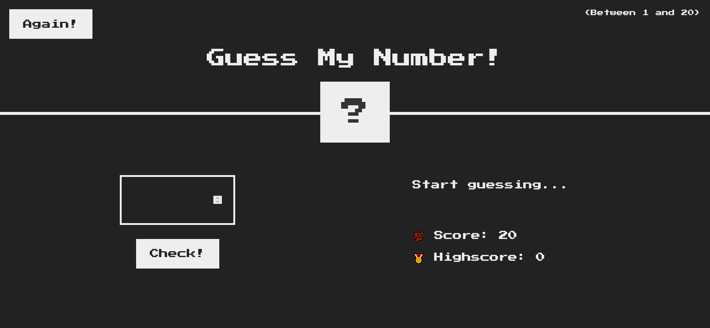
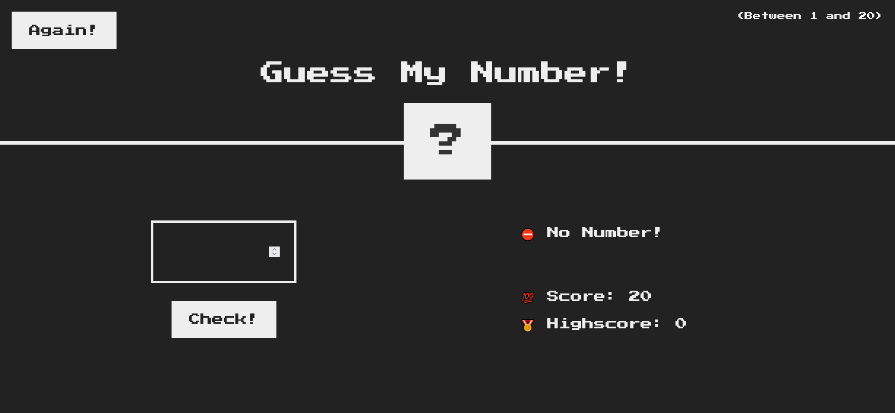
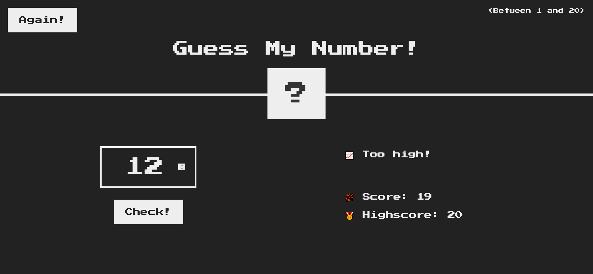
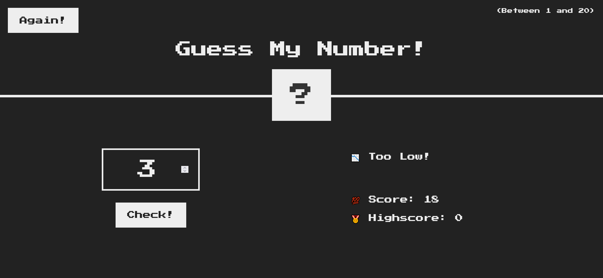
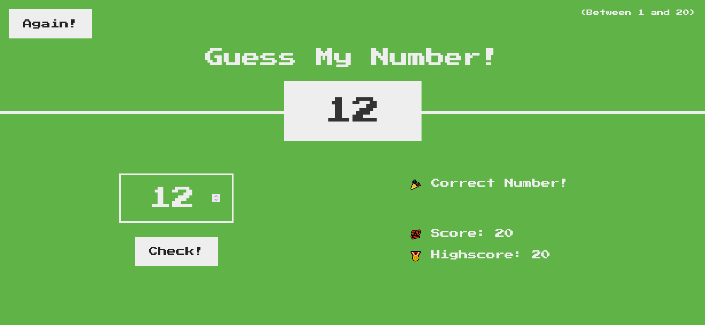

# Welcome! 👋
# This (GuessNumber) project is built to practice DOM manipulation.

# Intial Preview

# For when no number entered 

# For when the number is too high

# For when the number is too low

# For when the number is correct

# Built with
    
    JavaScript 
    DOM Manipulation
    Semantic HTML5 markup
    CSS properties
    Flexbox
    

